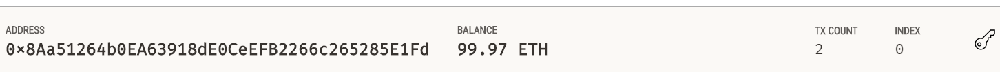
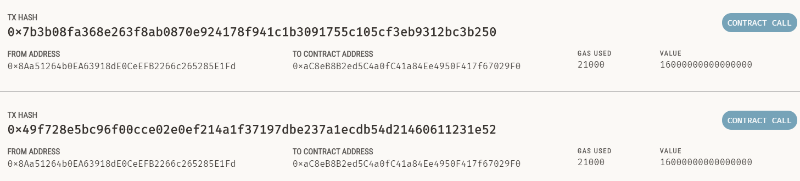

# Cryptocurrency_Payment


The Fintech_Finder and crypto_wallet build a web interface page to find fintech professionals from among a list of candidates, hire them, and pay them. The web interface enables your customers to send cryptocurrency payments to fintech professionals.

## Technologies

This project leverages python 3.7 with the following packages:


* [pandas](https://pandas.pydata.org/pandas-docs/stable/index.html) - For Series, DataFrame, and plots

* [streamlit](https://docs.streamlit.io/library/get-started) - For deploying data apps

* [dataclasses](https://docs.python.org/3/library/dataclasses.html) - For decorator and functions for automatically adding generated special methods such as __init__() and __repr__() to user-defined classes

* [typing](https://docs.python.org/3/library/typing.html) - For runtime support for type hints.

* [datetime](https://docs.python.org/3/library/datetime.html) - For manipulating dates and times.

* [hashlib](https://docs.python.org/3/library/hashlib.html) - For common interface to many different secure hash and message digest algorithms.

* [os](https://docs.python.org/3/library/os.html) - For creating and removing a directory (folder), fetching its contents, changing and identifying the current directory, etc

* [requests](https://pypi.org/project/requests/) - For send HTTP requests using Python

* [web3](https://web3py.readthedocs.io/en/stable/?msclkid=bcb1785dce7711ec9c58883163077783) - For interacting with Ethereum

* [bip44](https://pypi.org/project/bip44/?msclkid=0c5757d0ce7811ec86ed75520288e54e) - For generating a 12- or 24-word mnemonic seed phrase based on the BIP-39 standard

* [ethereum-tester](https://pypi.org/project/ethereum-tester/0.1.0a4/) - For testing Ethereum-based applications

* [mnemonic](https://pypi.org/project/mnemonic/) - For generating a 12- or 24-word mnemonic seed phrase based on the BIP-39 standard

* [Ganache](https://trufflesuite.com/ganache/) - For setting up a local blockchain, which you can use to test and develop smart contracts


## Installation Guide

Before running the application first install the following dependencies.

```python
  pip install pandas
  pip install streamlit
  pip install bip44
  pip install web3==5.17
  pip install eth-tester==0.5.0b3
  pip install mnemonic
```

Ganache download is required.

## Usage

To use the fintech finder, simply clone the all the files from the respository, open CLI and run **fintech_finder.py** with:

```python
streamlit run fintech_finder.py
```

Here is a screenshot of sender's transaction history and account balance and recepient's address.





## Contributors

Brought to you by FinTech Material and Eunice

---

## License

MIT